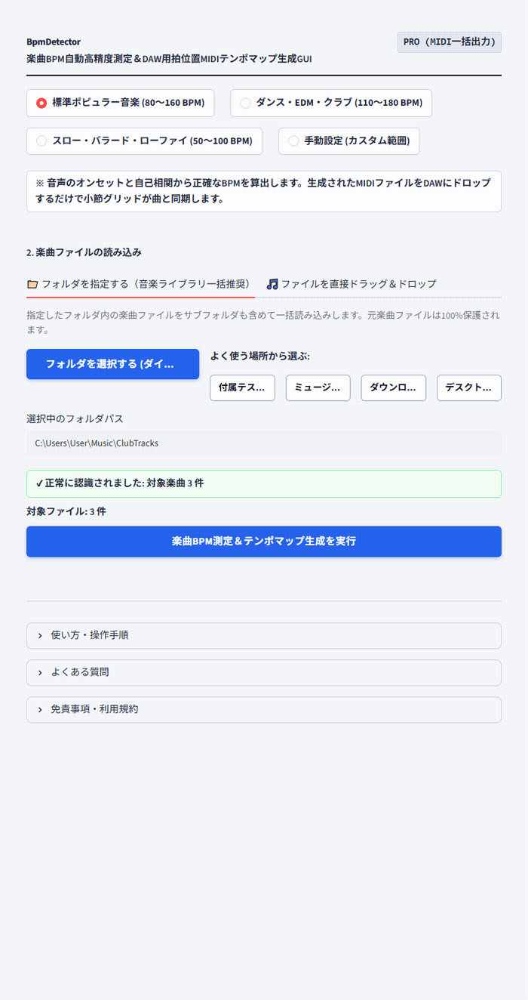

# 【Windows専用】BpmDetector GUI ｜ 楽曲BPM自動高精度測定＆DAW用MIDIテンポマップ生成GUI

> **「DAWのタップテンポを画面の前で連打する時間は、もう終わりにしよう。」**  
> ドラッグ＆ドロップ3秒。楽曲ファイルを放り込むだけで、小数点第1位までBPMを高精度に自動測定し、DAWにドラッグ＆ドロップするだけでプロジェクトテンポと小節線グリッドが瞬時に完全同期する「Standard MIDI テンポマップファイル（`.mid`）」を生成するWindows専用ポータブルGUIツールです。

## ■ 操作デモ（実際の動作）

---

## ■ こんな「テンポ合わせの地道な手探り」、毎回繰り返していませんか？

- **手動タップでの測定に疲れる**: DAWのタップテンポ機能やスマホアプリでリズムに合わせてボタンを連打し、「BPM 124かな？125かな？」と迷う時間の無駄。
- **曲が進むとグリッドから微妙にズレる**: 整数BPM（128など）で合わせたはずなのに、2番のサビや後半になると波形と小節線のズレが目立ってきて、MIDIの打ち込みやエディットが合わなくなる。
- **リミックスや耳コピの初期設定に時間がかかる**: 楽曲のBPM特定とDAWのタイムライン同期に毎回10分〜15分かかり、一番モチベーションの高い出だしで出鼻をくじかれる。
- **倍テンポ（2倍）や半テンポ（半分）で誤判定される**: 市販の簡易解析ツールを使うと、バラードなのにBPM 160と出たり、ダンス曲なのにBPM 65と判定されて混乱する。

楽曲制作、耳コピ、歌ってみたMIX、DJプレイにおいて、BPMの正確な特定はすべての基盤です。  
しかし、**本来アレンジやMIX、演奏に注ぐべき貴重な集中力を、「手動のテンポ測定と微調整」に奪われ続ける必要はありません。**

「BpmDetector GUI」は、音楽クリエイターのテンポ合わせストレスをゼロにするために生まれた、完全実務特化型のポータブルソフトウェアです。

---

## ■ なぜ、他の方法ではなく「BpmDetector」なのか？（4つの圧倒的理由）

### 1. 小数点第1位まで見抜く「自己相関 ＋ 放物線補間アルゴリズム」
打楽器やアタック成分（オンセット強度エンベロープ）を高精度に抽出し、自己相関関数（Autocorrelation）と放物線補間（Parabolic Interpolation）を組み合わせることで、**小数点第1位の精度で真のBPMを算出**します。微細なテンポ設定がされた音源でも、後半までグリッドがビシッと合致します。

### 2. DAWのグリッドが一瞬で揃う「Standard MIDI テンポマップ（.mid）」自動生成
国際規格に完全準拠した Standard MIDI File (Format 0) を自動出力。  
生成された `.mid` ファイルをCubase, Studio One, Logic, Pro Tools, Reaper, FL StudioなどのDAWにドラッグ＆ドロップするだけで、**DAW側のタイムラインテンポと小節線グリッドが瞬時に楽曲と完全同期**します。

### 3. 倍テン・半テンの誤検出を防ぐ「ジャンル別探索プリセット」
- **標準ポピュラー音楽（推奨）**: `80〜160 BPM`（J-POP、ロック、アニソンなど最も一般的な楽曲）
- **ダンス・EDM・クラブ**: `110〜180 BPM`（ハウス、テクノ、トランス等）
- **スロー・バラード・ローファイ**: `50〜100 BPM`（ゆったりしたバラードやチル系）
- **手動設定 (カスタム範囲)**: `30〜300 BPM` まで自由に指定可能  
探索範囲をあらかじめ絞り込むことで、ジャンルに応じた最適なBPMを一発で確実に検出します。

### 4. 面倒な環境構築ゼロ。解凍してダブルクリックですぐ起動
Pythonのインストールや面倒なコマンド入力、黒い画面（コマンドプロンプト）は一切不要です。  
配布ZIPを解凍し、`BpmDetector.vbs` をダブルクリックするだけで直感的な操作画面がスッと立ち上がります。USBメモリに入れて持ち運ぶことも可能です。

---

## ■ 作業時間は「10分」から「3秒」へ（使い方3ステップ）

1. **起動する**: フォルダ内の `BpmDetector.vbs` をダブルクリックします。
2. **放り込む**: 測定したい楽曲ファイル（WAV, MP3, FLAC, M4A, OGG）をまとめてドラッグ＆ドロップします。
3. **ボタンを押す**: **「一括BPM測定＆タグ書き込みを実行」** をクリック。
   - 画面上に高精度なBPM測定結果と、DAW用MIDIファイル（`.mid`）のダウンロードボタンが現れます。
   - 複数ファイルの一括解析時は、**「📦 MIDIと測定レポートを一括保存 (ZIP)」** から全曲のテンポマップとExcelで見られるCSVが一瞬で手に入ります。

---

## ■ 動作環境・仕様

- **対応OS**: Windows 10 / 11 (64-bit)
- **インストール**: 不要（完全スタンドアロン動作・Embedded Python同梱）
- **対応入力フォーマット**: WAV, MP3, FLAC, OGG, M4A
- **出力ファイル**: Standard MIDI File (Format 0 / `.mid`)、測定レポートCSV
- **安全設計**: 完全オフライン動作（外部サーバー通信一切なし・未公開デモ音源も安心）

---

## 🛒 ダウンロード・ご購入のご案内（BOOTH公式ストア）

まずは使い勝手をお手元のPCでお試しいただけるよう、無料Lite版と全機能対応の製品版をご用意しております。

👉 **[BOOTHでダウンロード・購入する](https://nichesoftmakers.booth.pm/items/8809387)**  
- **無料Lite版**: 0円（まずは基本機能や快適な操作感をお試しいただけます）
- **製品版**: **2,980円**（追加課金なしの買い切り・全機能無制限）

動画編集・音声処理・事務自動化など、全ツールの製品版やおトクな業務別バンドルパックも公式BOOTHストアにて公開中です。

---

## 💡 【ご購入・ご利用前に必ずご確認ください】初回起動時のWindows保護画面について

本ソフトは、パソコンのレジストリを変更せず解凍するだけで手軽に使える「ポータブル仕様（インストール不要）」として提供されているため、初回起動時にWindowsの画面に「**WindowsによってPCが保護されました**」という青い確認画面（SmartScreen）が表示される場合があります。

これは、パソコンのレジストリを変更せず手軽に使える未署名のツールに対して、**Windowsが形式上必ず表示する標準的な安全確認画面**です。  
ウイルス等の不正プログラムは一切含まれておらず、インターネット通信も行わない「完全ローカル・安全設計」となっております。

**【解除・起動手順（2クリックで完了します）】**
1. 画面内の **「詳細情報」** をクリックします。
2. 右下に現れる **「実行」** ボタンをクリックします。  
※一度実行すれば、次回以降はこの画面は表示されずスムーズに起動します。

---

## 📄 免責事項・利用規約（ライセンス区分）

- **個人利用を想定**: 本ソフトウェアは個人クリエイター・個人事業主等のPC業務効率化を目的として開発された個人利用専用ツールです。
- **シングルユーザー許諾**: ご購入者様本人（1名）のみ利用可能（ご自身が専属で使用する複数台PCでの利用は許可されます）。組織内での共有・複数名での共同利用・社内共有には対応しておりません。
- 本ソフトウェアは現状有姿（As-Is）で提供され、技術サポート・個別動作保証は行われません。詳細は同梱の `README.txt` をご確認ください。

---

---

## 🔗 公式リンク・関連メディア（相互リンク）

- 🛒 **公式BOOTHストア（製品版・買い切り）**:  
  👉 **[BOOTHで製品版を購入する](https://nichesoftmakers.booth.pm/items/8809387)**  
  全ツールの正規版および、おトクな業務別バンドルパックを公開しています。
- 📝 **公式noteマガジン（全ツールの開発ストーリー・作品カタログ）**:  
  👉 **[公式noteマガジンで全ツール一覧・解説を見る](https://note.com/nichesoftmakers/m/m0609d07d7385)**
- 📘 **開発アーキテクチャ・技術連載（Zenn）**:  
  👉 **[ポータブルGUIツールの設計思想・技術解説](https://zenn.dev/)**
- 📮 **ご意見・不具合報告・機能要望目安箱**:  
  👉 **[ご意見・不具合報告フォーム（完全匿名）](https://forms.gle/2ib5A8EuhpaRs8QSA)**